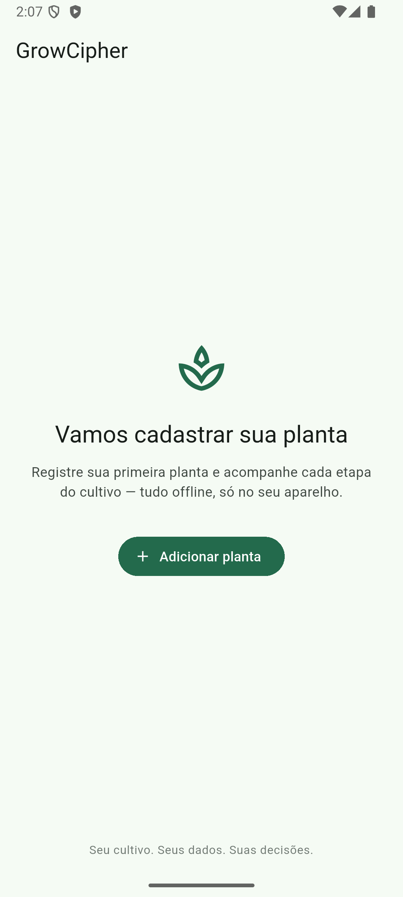

# GrowCipher

## Seu cultivo. Seus dados. Suas decisões.

O GrowCipher é um diário local e offline-first para microcultivadores que querem registrar plantas, ciclos e acontecimentos sem transformar a rotina de cultivo em uma planilha interminável.

O projeto é voltado a cultivadores de cannabis que atuam dentro da legislação local, com foco em autonomia, privacidade por padrão e histórico útil. O fluxo atual roda sem conta e sem conexão permanente: os registros ficam no aparelho, em um banco SQLite local.

> **Status:** MVP em desenvolvimento. O repositório é público, mas ainda não é uma versão pronta para produção.



## Por que existe

Cultivar exige memória: quando regou, o que mudou, qual fase demorou mais, o que funcionou e o que precisa ser acompanhado. O GrowCipher transforma esses acontecimentos em um histórico simples de consultar — sem feed, ranking, marketplace ou publicidade.

## O que já funciona

- Cadastro guiado de plantas em nove passos, com caminhos para semente, muda, clone ou cultivo em andamento.
- Código local discreto (`GC-XXXX`) para identificar uma planta sem depender de um nome.
- Registro rápido de 12 tipos de acontecimento, incluindo rega, alimentação, medição, tratamento, problema, colheita e encerramento.
- Linha do tempo individual por planta, preservando o histórico dos eventos.
- Persistência local em SQLite com migrações versionadas.
- Interface em pt-BR, tema claro/escuro e suporte multiplataforma via Flutter.


## A direção do produto

O MVP é a primeira camada de um diário de cultivo mais completo. O roadmap inclui cofre criptografado, fotos privadas com remoção de EXIF, exportação/backup protegido, progressão local e análise determinística baseada no próprio histórico.

Esses itens são parte da visão do produto, não promessas da versão atual. O GrowCipher não deve anunciar criptografia do banco, galeria privada, backup protegido ou IA local como recursos já disponíveis antes de suas implementações serem concluídas.

## Para quem é

- Microcultivadores que precisam de organização sem um sistema empresarial.
- Pessoas que preferem registrar a própria experiência em vez de seguir uma “receita universal”.
- Usuários que querem um diário local, discreto e independente de uma rede social.
- Desenvolvedores interessados em privacidade, Flutter e software local-first.

## O que o GrowCipher não é

Não é marketplace, rede social, plataforma de anúncios, ferramenta de compra e venda ou sistema de vigilância. Também não substitui orientação profissional, legislação local ou o julgamento do cultivador.

## Começando

Requisitos: Flutter 3.44.9 e Dart compatível com o SDK definido em [`pubspec.yaml`](pubspec.yaml).

```bash
flutter pub get
flutter test
flutter run
```

O idioma padrão do produto é pt-BR. A documentação de produto e design está em [`docs/`](docs/), começando por [`docs/GrowCipher.md`](docs/GrowCipher.md).

## Princípios

- **Local-first:** registrar não deve depender de um servidor estar disponível.
- **Privacidade explícita:** o usuário decide o que identifica, guarda, exporta ou compartilha.
- **Histórico antes de automação:** o app organiza a experiência antes de tentar interpretá-la.
- **Sugestão, nunca ordem:** qualquer análise deve mostrar evidência e preservar a decisão humana.
- **Honestidade:** registrar que algo deu errado também é conhecimento valioso.

## Marketing e identidade

O pacote de comunicação público está em [`docs/marketing/`](docs/marketing/): posicionamento, copy de landing page, descrição para lojas, mensagens sociais e critérios para não prometer funcionalidades futuras como se já existissem.

## Licença

O GrowCipher é distribuído sob a licença [MIT](LICENSE) — Copyright (c) 2026 Ricardo Sierra.

O identificador do aplicativo Android é `com.sierratecnologia.growcipher`.
